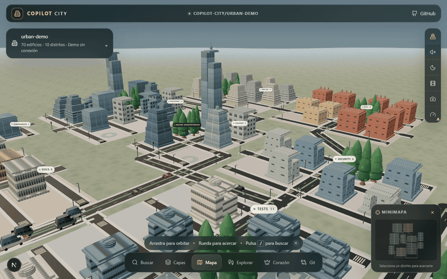
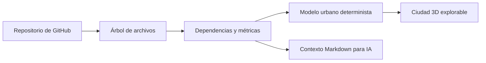

<div align="center">
  

  <h1>Copilot City</h1>

  <p><strong>No leas tu codebase. Recórrela.</strong></p>
  <p>Convierte cualquier repositorio de GitHub en una ciudad 3D que puedes explorar, entender y compartir.</p>

  <p>
    <a href="https://copilotcity.joseortega.lat/"></a>
    <a href="https://github.com/joseorteha/copilot-city"></a>
    <a href="https://x.com/mr_orteega"></a>
  </p>

  <p>
    <a href="#qué-es-copilot-city">Qué es</a> ·
    <a href="#cómo-se-lee-la-ciudad">Cómo funciona</a> ·
    <a href="#inteligencia-arquitectónica">Inteligencia</a> ·
    <a href="#contexto-markdown-para-ia">Contexto para IA</a> ·
    <a href="#tecnología">Tecnología</a>
  </p>
</div>

<p align="center">
  <a href="https://copilotcity.joseortega.lat/">
    
  </a>
</p>

<p align="center"><sub>Captura real del producto · ciudad de demostración · día, recorrido cinematográfico y noche analítica</sub></p>

## Qué es Copilot City

Copilot City toma un repositorio público de GitHub y lo levanta como una ciudad. Las carpetas son distritos, los archivos son edificios y las dependencias son las calles que los conectan.

Nada es decorativo: cada forma sale del código. La altura marca la escala, la silueta indica la función, las calles muestran quién depende de quién y el centro urbano señala las piezas de las que depende todo lo demás. En lugar de leer cientos de archivos, sobrevuelas el sistema y lo entiendes de un vistazo.

<table>
  <tr>
    <td align="center"><strong>11</strong><br/><sub>arquetipos de edificios</sub></td>
    <td align="center"><strong>8</strong><br/><sub>capas analíticas</sub></td>
    <td align="center"><strong>2</strong><br/><sub>formas de explorar</sub></td>
    <td align="center"><strong>1 .MD</strong><br/><sub>con el contexto para IA</sub></td>
  </tr>
</table>

## Cómo se lee la ciudad

Cada elemento del repositorio tiene su equivalente en la ciudad. Una vez que conoces el mapa, la arquitectura se lee sola.

| En el repositorio | En Copilot City      | Qué te dice                               |
| ----------------- | -------------------- | ----------------------------------------- |
| Carpeta raíz      | Distrito             | Los grandes dominios del proyecto         |
| Subcarpeta        | Barrio               | Cómo se agrupan las responsabilidades     |
| Archivo           | Edificio             | Tamaño, lenguaje, complejidad y actividad |
| Importación       | Calle o conexión     | Quién depende de quién                    |
| Archivo central   | Landmark             | El corazón arquitectónico del sistema     |
| Pull Request      | Obra en construcción | Qué parte de la ciudad está cambiando     |
| Colaborador       | Habitante            | Quién trabaja en cada zona                |
| GitHub Actions    | Clima                | La salud actual de la automatización      |



## Una ciudad para entender, no solo para mirar

<table>
  <tr>
    <td width="50%" valign="top">
      <h3>Exploración espacial</h3>
      <p>Sobrevuela el sistema en <strong>Mapa</strong> o camina entre sus edificios en <strong>Explorar</strong>. El buscador salta a cualquier archivo y la cámara enfoca el núcleo arquitectónico al instante.</p>
    </td>
    <td width="50%" valign="top">
      <h3>Inspector de edificios</h3>
      <p>Haz clic en un archivo y obtén líneas, complejidad, dependencias, dependientes, actividad reciente, riesgo, autoría y una vista previa del código.</p>
    </td>
  </tr>
  <tr>
    <td width="50%" valign="top">
      <h3>Historia visible</h3>
      <p>Recorre la línea de tiempo de Git, mira los Pull Requests como obras activas y detecta ciclos o rutas recomendadas por la arquitectura.</p>
    </td>
    <td width="50%" valign="top">
      <h3>Comparación urbana</h3>
      <p>Pon dos repositorios lado a lado como ciudades: escala, complejidad, lenguajes y conexiones se vuelven diferencias que se ven.</p>
    </td>
  </tr>
</table>

## Inteligencia arquitectónica

La misma ciudad responde preguntas distintas sin cambiar de forma. Sus ocho capas sacan a la luz información que normalmente vive repartida entre archivos, herramientas y reportes.

| Capa            | Lo que hace visible                           |
| --------------- | --------------------------------------------- |
| **Estructura**  | La organización natural del repositorio       |
| **Complejidad** | Dónde se concentra la lógica difícil          |
| **Actividad**   | Las zonas que cambiaron hace poco             |
| **Conexiones**  | Dependencias entrantes y salientes            |
| **Prioridad**   | Archivos cuyo riesgo merece atención          |
| **Autoría**     | Quién es responsable de cada código           |
| **Tests**       | Dónde hay pruebas y dónde faltan              |
| **Corazón**     | El núcleo de mayor centralidad arquitectónica |

Si una ejecución reciente de GitHub Actions falla, llueve sobre la ciudad. Si hay un Pull Request abierto, su zona entra en obra. La información técnica deja de ser una tabla aparte y pasa a formar parte del mundo.

## Contexto Markdown para IA

Copilot City también empaqueta el repositorio en un solo archivo `.md` pensado para asistentes de IA. La exportación reúne:

- identidad y resumen del repositorio;
- árbol de archivos navegable;
- lenguajes, métricas y mapa de dependencias;
- contenido textual relevante con rutas claras;
- conteo aproximado de tokens y aviso de truncamiento;
- exclusión automática de binarios, builds, dependencias, credenciales, llaves y archivos `.env`.

Es contexto portable: lo pegas en una conversación, lo guardas en tu documentación o lo usas como punto de partida para revisar una codebase sin perder su estructura.

> **Un repositorio, dos formas de entenderlo:** la ciudad para construir tu mapa mental y el Markdown para darle ese mismo contexto a una IA.

## Experiencia visual

- Arquitectura procedural con fachadas, terrazas, zócalos comerciales, coronas y azoteas técnicas.
- Once familias de edificios con identidad semántica y variación determinista.
- Tráfico, alumbrado, vegetación, plazas, pasos peatonales y mobiliario urbano.
- Modos de día y noche analítica con interiores y luminarias encendidas.
- Minimapa interactivo, recorrido cinematográfico y exportación de fotografía PNG.
- Materiales PBR, ambient occlusion, tone mapping AgX y calidad adaptable.
- Vehículos y árboles GLB reales, agrupados por instancia para conservar detalle y rendimiento.

## Tecnología

<p align="center">
  
</p>

<p align="center">
  
  
  
  
  
  
  
  
  
  
</p>

| Capa        | Herramientas                                 | Papel dentro del producto                              |
| ----------- | -------------------------------------------- | ------------------------------------------------------ |
| Aplicación  | **Next.js 15 · React 19 · TypeScript**       | Interfaz, rutas de análisis y modelo de datos          |
| Mundo 3D    | **Three.js r186 · React Three Fiber · Drei** | Renderizado, cámara, iluminación e interacción         |
| Experiencia | **Tailwind CSS 4 · Zustand**                 | Sistema visual y estado global de la ciudad            |
| Datos       | **GitHub REST API · Zod**                    | Repositorio, historial, PRs, Actions y validación      |
| Calidad     | **Vitest · Playwright · ESLint**             | Pruebas deterministas, regresión visual y consistencia |

## Cómo se construye una ciudad

```bash
git clone https://github.com/joseorteha/copilot-city.git
cd copilot-city
npm install
npm run dev
```

Abre `http://localhost:3000`, pega la URL de un repositorio público y deja que la ciudad se levante. Con un `GITHUB_TOKEN` en el entorno obtienes mayor límite de peticiones y un historial más profundo.

## Principios del proyecto

1. **Toda forma tiene significado.** Si un edificio destaca, el código explica por qué.
2. **Primero legible, después espectacular.** La estética existe para que se entienda la arquitectura.
3. **La interfaz acompaña al mundo.** Los controles informan sin tapar la escena.
4. **La experiencia se mantiene fluida.** El detalle se comparte, instancia y simplifica según la distancia.
5. **El contexto es del usuario.** La exportación evita secretos y explica cualquier límite aplicado.

La visión de producto y las decisiones de diseño están en [Copilot City · Contexto Maestro](./docs/Copilot_City_Contexto_Maestro_ES.md) y [Dirección Visual 3D 2026](./docs/COPILOT_CITY_DIRECCION_VISUAL_3D_2026.md).

## Creador

<table>
  <tr>
    <td width="118" align="center">
      <a href="https://github.com/joseorteha">
        
      </a>
    </td>
    <td valign="middle">
      <h3>José Ortega · Mr. Ortega</h3>
      <p>Desarrollador desde Zongolica, Veracruz. Hago experiencias donde el código se vuelve algo que también se puede recorrer, mirar y compartir.</p>
      <p>
        <a href="https://x.com/mr_orteega">X · @mr_orteega</a> ·
        <a href="https://github.com/joseorteha">GitHub</a> ·
        <a href="https://www.joseortega.lat/">Portafolio</a> ·
        <a href="https://www.linkedin.com/in/jose-orteg4">LinkedIn</a> ·
        <a href="https://www.instagram.com/mr.orteg4/">Instagram</a>
      </p>
    </td>
  </tr>
</table>

<div align="center">
  <p><strong>El software también tiene calles, barrios, historia y un corazón.</strong></p>
  <p><sub>Diseñado y construido por <a href="https://github.com/joseorteha">José Ortega</a> · <a href="https://x.com/mr_orteega">@mr_orteega</a></sub></p>
</div>
